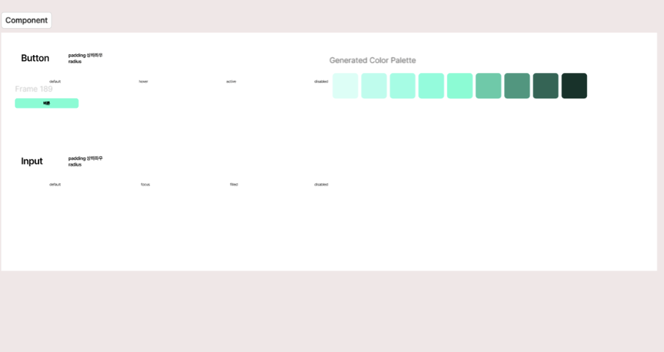
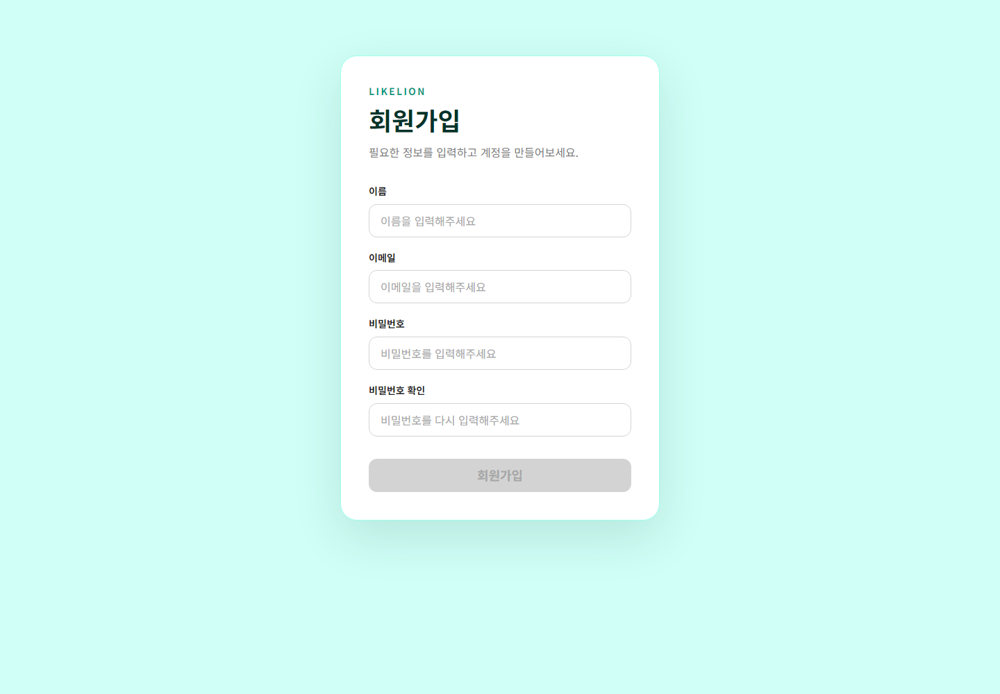

# 회원가입 페이지 과제

Figma에서 구성한 디자인 시스템을 React와 Tailwind CSS로 구현한 회원가입 페이지입니다.

## 구현 내용

- React + Vite 기반 회원가입 페이지
- Tailwind CSS v4 및 `@tailwindcss/vite` 적용
- Figma Primary/Neutral Color Variable과 Typography 적용
- 재사용 가능한 `Input` 컴포넌트
- Input 상태 구현: Default / Focus / Filled / Disabled
- 세션에서 만든 재사용 가능한 `Button` 컴포넌트 활용
- Button 상태 구현: Default / Hover / Active / Disabled
- 버튼 클릭 시 색상·위치·크기가 변하는 클릭 모션과 완료 문구 제공
- 이름, 이메일, 비밀번호, 비밀번호 확인 입력값을 `useState`로 관리
- 모든 항목이 입력되기 전까지 회원가입 버튼 비활성화
- 모바일과 데스크톱을 고려한 반응형 레이아웃

## Figma



## 구현 화면



## 실행 방법

```bash
npm install
npm run dev
```

## 검증

```bash
npm run lint
npm run build
```
